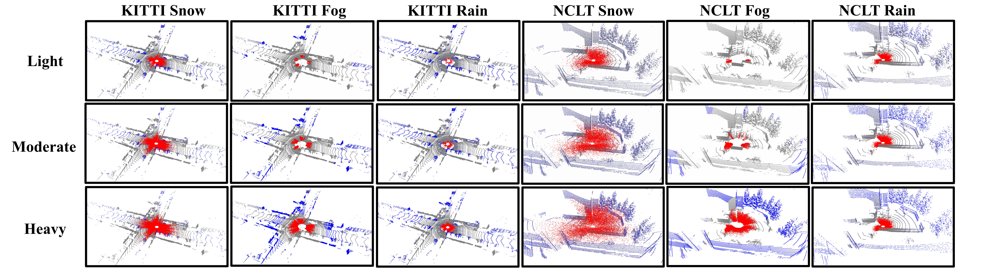
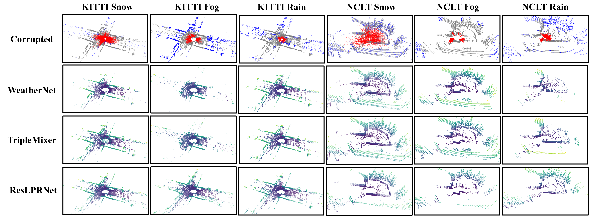
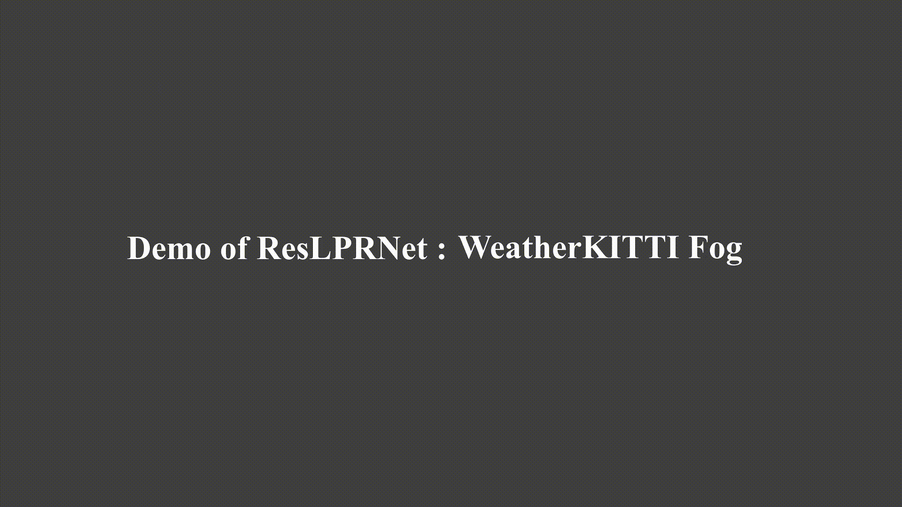
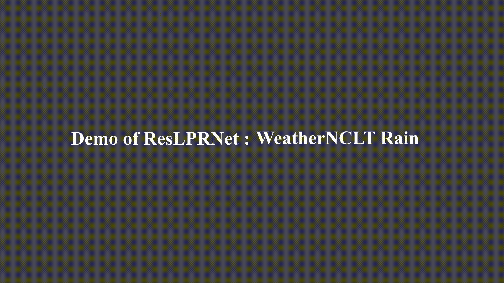

  

  
  
  

    

<h3 align="center">ResLPR: A LiDAR Data Restoration Network and Benchmark for Robust Place Recognition Against Weather Corruptions</h3>

  <a href="https://github.com/KuangWenqing">Wenqing Kuang</a>1,
  <a href="https://github.com/Grandzxw">Xiongwei Zhao</a>2,
  <a href="https://github.com/shenyehui">Yehui Shen</a>1,
  <a href="https://scholar.google.com.sg/citations?user=OTBgvCYAAAAJ&hl=zh-CN&oi=ao">Congcong Wen</a>3,
  <a href="https://scholar.google.com.hk/citations?hl=en&user=cp-6u7wAAAAJ">Huimin Lu</a>1,
  Zongtan Zhou1,
  <a href="https://github.com/Chen-Xieyuanli">Xieyuanli Chen</a>1

1National University of Defense Technology&nbsp;&nbsp;2Harbin Institute of Technology&nbsp;&nbsp;3New York University Abu Dhabi

### About
***ResLPR*** is a benchmark for LiDAR-based place recognition under adverse weather. ***ResLPRNet***, a lightweight network, restores corrupted LiDAR scans using wavelet transform. It helps pretrained models enhance the robustness of place recognition in bad weather in a ***plug-and-play*** manner.
1. The visualizations of ***WeatherKITTI*** and ***WeatherNCLT*** proposed by this benchmark are as follows:
  

  
  

Visualization of corrupted point clouds of varying severity in WeatherKITTI and WeatherNCLT. The 🔴 red points  in the point cloud signify the noise points, and the 🔵 blue points denote the lost points.

2. The visualizations of the results of three different preprocessing algorithms (including ResLPRNet) are as follows:
  

  
  

3. The demo of the results of WeatherKITTI are as follows:
  

  
  

  
4. The demo of the results of WeatherNCLT are as follows:
  

  
  

### Data Preparation
Our datasets are hosted by Baidu Netdisk. Download the dataset via this [ResLPR datasets](https://pan.baidu.com/s/1EN9v7zhDOU2mxKGqlhQvzQ?pwd=9d3f). The dataset is of an excessive size, and it is currently undergoing continuous updates. Kindly refer to [DATA_PREPARE.md](docs/DATA_PREPARE.md) for the details to prepare the 1`WeatherKITTI`, 2`WeatherNCLT`.

### Getting Started
The code is currently being organized and will be open-sourced within 48 hours.

